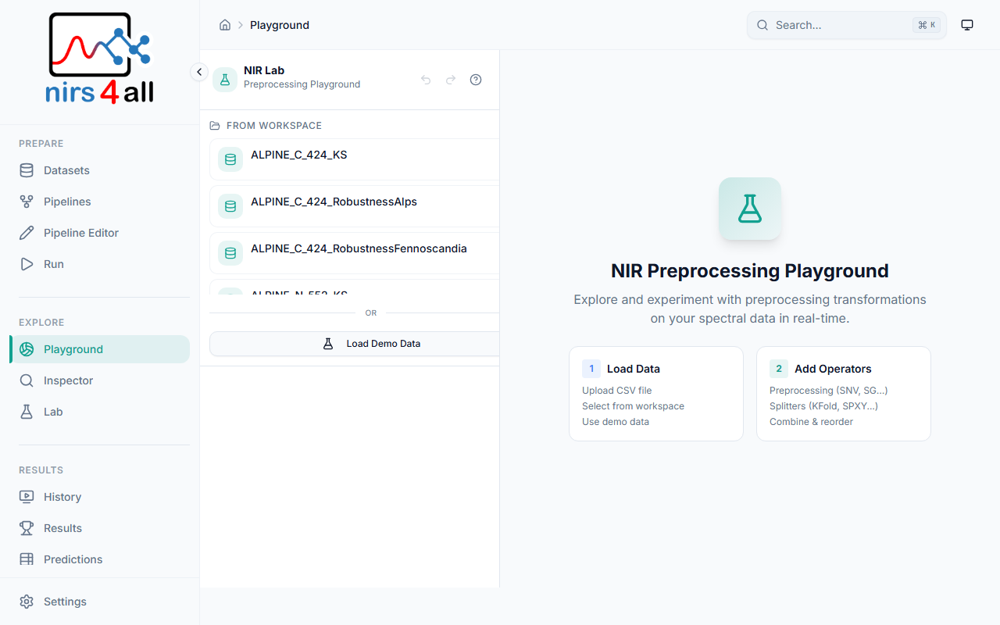
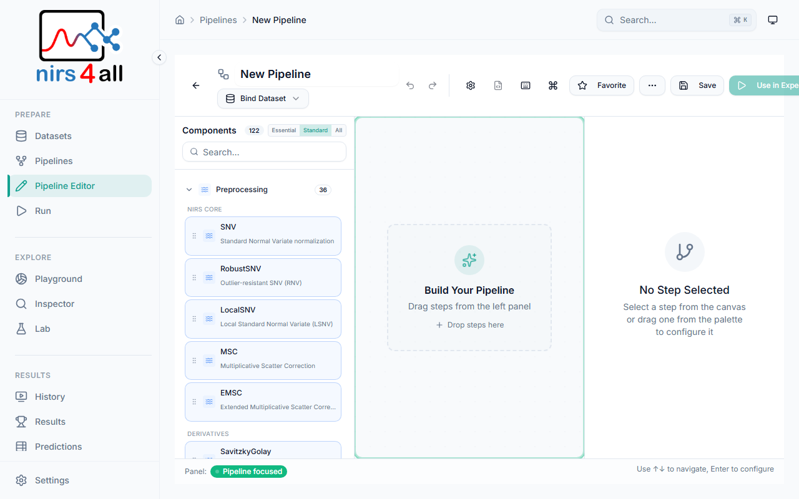
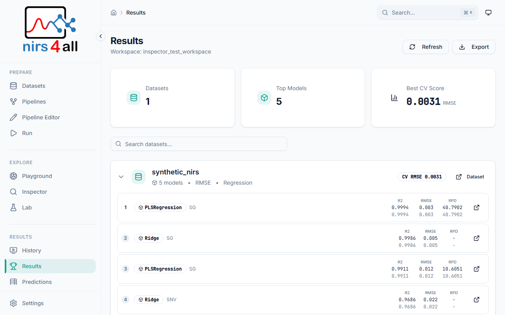
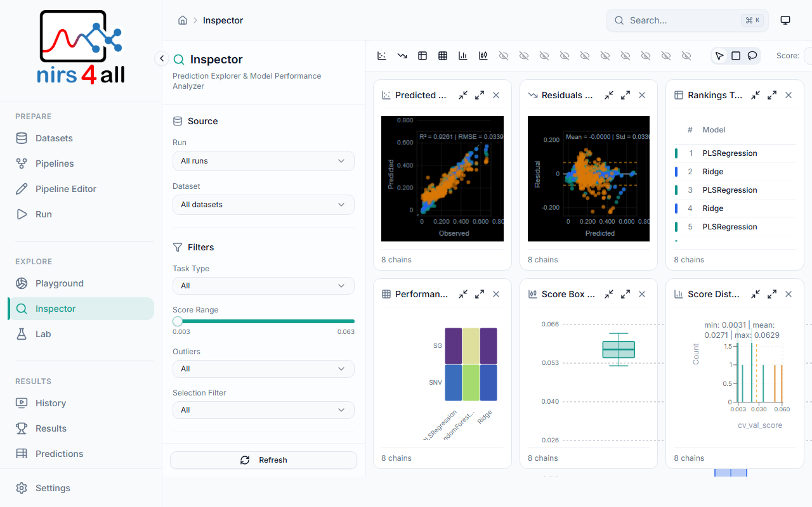
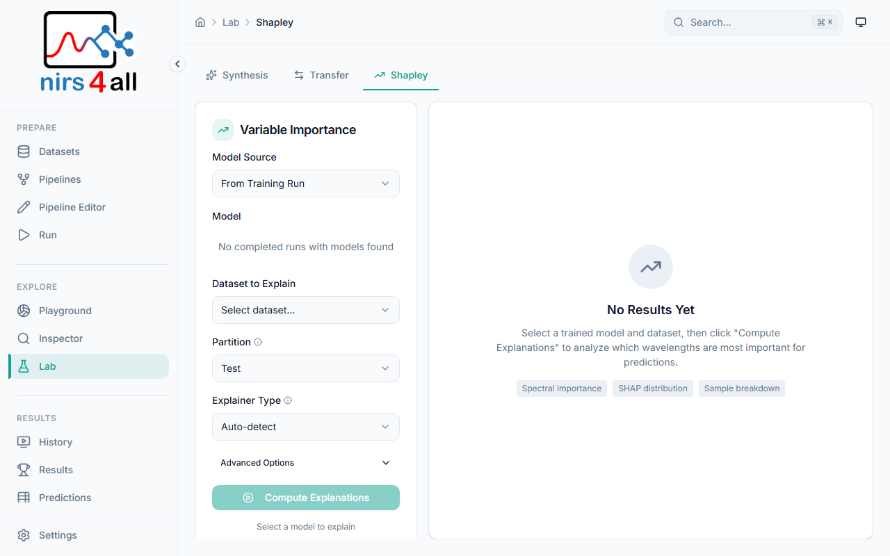
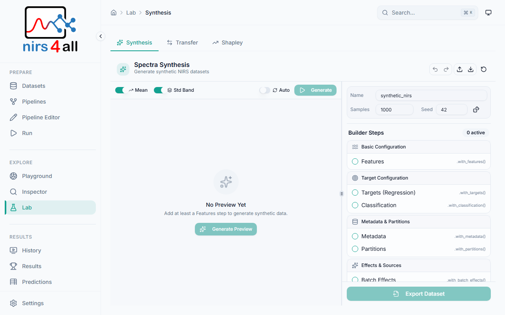
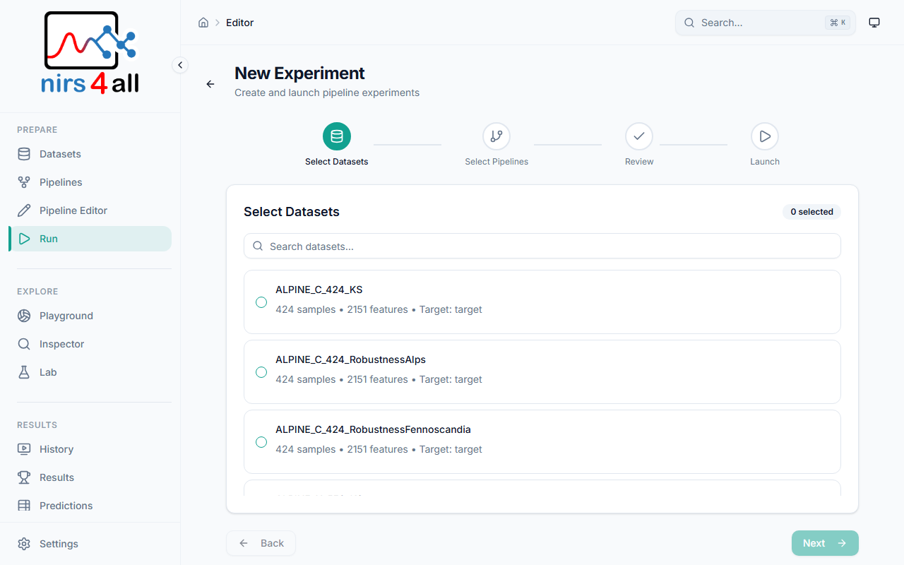

<div align="center">


# nirs4all Webapp

**Unified NIRS Analysis Desktop Application**

A modern desktop application for Near-Infrared Spectroscopy (NIRS) data analysis, combining the power of the [nirs4all](https://github.com/GBeurier/nirs4all) Python library with a sleek React-based user interface.

[](LICENSE)
[](https://nodejs.org/)
[](https://www.python.org/downloads/)

</div>

---

<div align="center">

<br><em>Playground — Interactive spectral exploration with PCA, distributions, and preprocessing preview</em>
</div>

---

## Features

- **Spectral Data Visualization** - Interactive charts for exploring NIRS spectra
- **Pipeline Builder** - Visual drag-and-drop pipeline construction
- **Prediction Engine** - Run trained models on new samples
- **Workspace Management** - Organize datasets, pipelines, and results
- **Native Desktop Experience** - Runs as a standalone desktop app via Electron
- **GPU Acceleration** - CUDA (Linux/Windows) and Metal (macOS) support

<div align="center">

<br><em>Pipeline Editor — Drag-and-drop builder with component library, validation, and hyperparameter tuning</em>
</div>

<br>

<div align="center">


<br><em>Left: Dataset management — Right: Results with model ranking and CV scores</em>
</div>

<br>

<div align="center">


<br><em>Left: Inspector — prediction analysis and model diagnostics — Right: Lab — SHAP variable importance</em>
</div>

<br>

<div align="center">


<br><em>Left: Spectra Synthesis — realistic NIR data generation — Right: Experiment wizard</em>
</div>

## Tech Stack

### Frontend
- **React 19** with TypeScript (strict mode)
- **Vite** for fast development and optimized builds
- **Tailwind CSS** with custom scientific design system
- **shadcn/ui** component library
- **TanStack Query** for API state management
- **Framer Motion** for smooth animations

### Desktop Shell
- **Electron 40** for cross-platform desktop experience
- **Chromium** for consistent WebGL support across all platforms
- **IPC Bridge** for secure main/renderer communication

### Backend
- **FastAPI** for high-performance REST API
- **nirs4all** Python library for NIRS analysis
- **PyInstaller** for standalone backend packaging

## Getting Started

### Prerequisites

- Node.js 20+ (recommended: use `nvm` + the version in `.nvmrc`)
- Python 3.11+
- nirs4all library (optional for UI development)

### Cross-Platform Support

This project supports development on:
- **Windows Native** - PowerShell, cmd.exe, or Windows Terminal
- **Linux** - Any distribution with Node.js and Python
- **macOS** - Intel and Apple Silicon
- **WSL2** - Windows Subsystem for Linux

---

### Windows Native Setup

1. **Install Node dependencies:**
   ```cmd
   npm install
   ```

2. **Install Python dependencies:**
   ```cmd
   python -m venv .venv
   .venv\Scripts\activate
   pip install -r requirements-cpu.txt
   ```

3. **Start development servers:**

   ```cmd
   npm start             REM Frontend + backend together (web dev)
   npm run start:desktop REM Electron desktop mode
   npm run stop          REM Stop all servers
   ```

   Or run frontend and backend separately:
   ```cmd
   npm run dev          REM Frontend (Vite) at http://localhost:5173
   ```

   Terminal 2:
   ```cmd
   .venv\Scripts\activate
   python -m uvicorn main:app --reload --port 8000
   ```

---

### Linux / macOS Setup

1. **Install Node dependencies:**
   ```bash
   npm install
   ```

2. **Install Python dependencies:**
   ```bash
   python -m venv .venv
   source .venv/bin/activate
   pip install -r requirements-cpu.txt  # or requirements-gpu.txt for GPU
   ```

3. **Start development servers:**

   ```bash
   npm start             # Frontend + backend together (web dev)
   npm run start:desktop # Electron desktop mode
   npm run stop          # Stop all servers
   ```

   Or run frontend and backend separately:
   ```bash
   npm run dev          # Frontend (Vite) at http://localhost:5173
   ```

   Terminal 2:
   ```bash
   source .venv/bin/activate
   python -m uvicorn main:app --reload --port 8000
   ```

---

### WSL2 Setup (Windows Subsystem for Linux)

If you prefer using WSL2, make sure you're using Linux `node`/`npm` (not the Windows ones mounted under `/mnt/c`).

1. **One-time: permanently disable Windows PATH injection into WSL** (prevents UNC/cmd.exe install failures):
   ```bash
   sudo tee /etc/wsl.conf <<'EOF'
   [interop]
   appendWindowsPath=false
   EOF
   ```
   Then restart WSL from Windows:
   ```powershell
   wsl.exe --shutdown
   ```

2. **Install/use Node via nvm (WSL-native):**
   ```bash
   npm run setup:wsl
   nvm use
   ```

Quick check (should NOT point to `/mnt/c/...`):
```bash
which node
which npm
```

Then follow the Linux setup instructions above.

---

### Desktop Mode (Electron)

To run as a desktop application:

```bash
# Development mode (with hot reload)
npm run dev:electron

# Build and preview (production mode)
npm run electron:preview
```

The Electron main process automatically spawns the Python backend and manages its lifecycle.

## Project Structure

```
nirs4all_webapp/
├── src/                    # React frontend source
│   ├── components/         # UI components
│   │   ├── layout/         # App layout (sidebar, header)
│   │   ├── pipeline-editor/# Pipeline Editor (see Architecture)
│   │   └── ui/             # shadcn/ui components
│   ├── context/            # React context providers
│   ├── data/               # Data models and registries
│   │   └── nodes/          # Node registry system
│   ├── lib/                # Utilities and helpers
│   ├── api/                # API client
│   ├── types/              # TypeScript type definitions
│   │   └── electron.d.ts   # Electron IPC types
│   └── pages/              # Route components
├── electron/               # Electron main process
│   ├── main.ts             # Main entry point (window management)
│   ├── preload.ts          # Secure IPC bridge (contextBridge)
│   ├── backend-manager.ts  # Python backend lifecycle management
│   ├── env-manager.ts      # Python environment detection and setup
│   └── logger.ts           # Persistent file logging
├── api/                    # FastAPI backend
│   ├── workspace.py        # Workspace management routes
│   ├── datasets.py         # Dataset operations
│   ├── pipelines.py        # Pipeline CRUD
│   ├── predictions.py      # Prediction storage
│   └── system.py           # Health, system info, and GPU detection
├── scripts/                # Build and utility scripts
│   ├── build-backend.cjs   # Python backend packaging (cross-platform)
│   └── build-release.cjs   # Full release build (cross-platform)
├── build/                  # Build configuration
│   └── entitlements.mac.plist  # macOS code signing entitlements
├── docs/                   # Documentation
│   └── _internals/         # Developer guides
├── public/                 # Static assets
├── main.py                 # FastAPI application entry
├── launcher.py             # PyInstaller entry point (production builds)
├── nirs4all-webapp.spec    # PyInstaller spec file
├── electron-builder.yml    # Electron packaging config
└── package.json            # Node dependencies
```

## Pipeline Editor Architecture

The Pipeline Editor is a visual pipeline builder for nirs4all workflows. It follows a modular architecture for maintainability and extensibility.

### Core Components

```
src/components/pipeline-editor/
├── config/                     # Configuration panel
│   └── step-renderers/         # Type-specific renderers
│       ├── DefaultRenderer.tsx # Standard algorithm + params
│       ├── ModelRenderer.tsx   # Model-specific UI
│       ├── MergeRenderer.tsx   # Merge step UI
│       └── ...
├── shared/                     # Reusable UI components
│   ├── ParameterInput.tsx      # Number/text inputs
│   ├── ParameterSelect.tsx     # Dropdown select
│   ├── ParameterSwitch.tsx     # Boolean toggle
│   ├── CollapsibleSection.tsx  # Expandable sections
│   ├── InfoTooltip.tsx         # Help tooltips
│   └── ValidationMessage.tsx   # Error/warning display
├── validation/                 # Validation system
│   ├── engine.ts               # Core validation engine
│   ├── parameterValidator.ts   # Parameter validation
│   ├── stepValidator.ts        # Step validation
│   ├── pipelineValidator.ts    # Pipeline structure
│   ├── rules.ts                # Validation rules registry
│   ├── useValidation.ts        # React hook
│   ├── ValidationPanel.tsx     # Issues display
│   └── ValidationContext.tsx   # React context
└── types.ts                    # Shared TypeScript types
```

### Node Registry System

```
src/data/nodes/
├── definitions/           # Node definitions (JSON)
│   ├── preprocessing/     # Preprocessing nodes
│   ├── models/            # Model nodes
│   ├── splitting/         # CV splitters
│   └── ...
├── custom/                # Custom node system
│   └── CustomNodeStorage.ts  # User-defined nodes
├── categories/            # Category configuration
├── NodeRegistry.ts        # Runtime registry
├── types.ts               # TypeScript types
└── index.ts               # Public API
```

### Key Design Patterns

| Pattern | Location | Purpose |
|---------|----------|---------|
| Registry | `NodeRegistry.ts` | Central node definition lookup |
| Validator | `validation/` | Multi-level validation with rules |
| Context | `ValidationContext.tsx` | Shared validation state |
| Factory | `step-renderers/` | Type-specific UI rendering |
| Singleton | `CustomNodeStorage` | Persistent custom nodes |

### Validation System

The validation system provides multi-level validation:

1. **Parameter Level**: Type checking, range validation, required fields
2. **Step Level**: Step structure, container validation
3. **Pipeline Level**: Model presence, splitter ordering, structure

```typescript
import { validate, useValidation } from './validation';

// Direct validation
const result = validate(steps, { strictMode: true });
console.log(result.isValid, result.errors);

// React hook (debounced)
const { isValid, errorCount, getStepIssues } = useValidation(steps);
```

### Custom Nodes

Users can define custom operators:

```typescript
import { CustomNodeStorage } from '@/data/nodes/custom';

const storage = CustomNodeStorage.getInstance();
storage.add({
  id: 'custom.my_transform',
  name: 'MyTransform',
  type: 'preprocessing',
  classPath: 'mypackage.MyTransform',
  description: 'Custom transform',
  source: 'custom',
  parameters: [/* ... */]
});
```

See [developer_guide_custom_nodes.md](docs/_internals/developer_guide_custom_nodes.md) for details.

### Test Coverage

| Area | Tests | Coverage |
|------|-------|----------|
| Shared Components | 231 | Unit tests for all props/states |
| Step Renderers | 87 | Renderer-specific behavior |
| Validation | 143 | Integration + unit tests |
| Custom Nodes | 82 | E2E workflow tests |

Run tests:
```bash
npm run test               # All tests (single run)
npm run test:watch         # Watch mode
npm run e2e                # Playwright end-to-end tests
```

### Storybook

Component documentation with Storybook:

```bash
npm run storybook          # Development server (port 6006)
npm run build-storybook    # Build static docs
```

Stories are located in `__stories__/` directories next to components.

## Scripts

### Launcher (Cross-Platform)

Use the unified launcher for all modes:

| Windows | Linux/macOS | Description |
|---------|-------------|-------------|
| `scripts\launcher.cmd start web:dev` | `./scripts/launcher.sh start web:dev` | Start frontend + backend (web dev) |
| `scripts\launcher.cmd start desktop:dev` | `./scripts/launcher.sh start desktop:dev` | Start Electron desktop (dev) |
| `scripts\launcher.cmd stop` | `./scripts/launcher.sh stop` | Stop all servers |
| `scripts\launcher.cmd status` | `./scripts/launcher.sh status` | Show server status |

Or use `npm run start` / `npm run start:desktop` / `npm run stop` directly.

### npm Scripts - Development

| Command | Description |
|---------|-------------|
| `npm run dev` | Start Vite dev server |
| `npm run dev:electron` | Start Electron with hot reload |
| `npm run dev:registry` | Start with node registry enabled |
| `npm run lint` | Run ESLint |
| `npm run test` | Run Vitest tests |
| `npm run test:watch` | Run tests in watch mode |
| `npm run storybook` | Start Storybook dev server |

### npm Scripts - Production Builds

| Command | Description |
|---------|-------------|
| `npm run build` | Build frontend for production |
| `npm run build:electron` | Build Electron app |
| `npm run electron:preview` | Preview Electron production build |
| `npm run build:backend` | Build Python backend (CPU, default) |
| `npm run build:backend:cpu` | Build Python backend (CPU) |
| `npm run build:backend:gpu` | Build Python backend (GPU/CUDA) |
| `npm run build:backend:gpu-metal` | Build Python backend (GPU/Metal for macOS) |
| `npm run build:backend:clean` | Clean and rebuild backend |
| `npm run build:release` | Full release build (CPU, current platform) |
| `npm run build:release:cpu` | Full release build (CPU edition) |
| `npm run build:release:gpu` | Full release build (GPU edition) |
| `npm run build:release:clean` | Clean and rebuild release |
| `npm run build:release:all` | Build for all platforms |

### npm Scripts - Packaging

| Command | Description |
|---------|-------------|
| `npm run electron:build` | Package for current platform |
| `npm run build:release --platform win` | Package for Windows |
| `npm run build:release --platform mac` | Package for macOS |
| `npm run build:release --platform linux` | Package for Linux |
| `npm run build:release --platform all` | Package for all platforms |

## Design System

The application uses a teal/cyan scientific theme inspired by spectral-explorer, featuring:

- **Glass morphism** cards with backdrop blur
- **Glow effects** for interactive elements
- **Dark/Light mode** with smooth transitions
- **Inter + JetBrains Mono** typography

## Logging and Crash Reporting

### Persistent Logs

In desktop mode, all main process logs are written to rotating log files:

| OS | Log location |
|----|-------------|
| Windows | `%APPDATA%\nirs4all-webapp\logs\` |
| macOS | `~/Library/Application Support/nirs4all-webapp/logs/` |
| Linux | `~/.config/nirs4all-webapp/logs/` |

### Sentry Crash Reporting (optional)

Automatic crash reporting via [Sentry](https://sentry.io/) can be enabled by setting the `SENTRY_DSN` environment variable. This captures errors from the Electron main process, the React frontend, and the Python backend.

```bash
# Set before launching the app
SENTRY_DSN=https://your-key@o123456.ingest.sentry.io/1234567

# For the React frontend (build-time), add to .env.production:
VITE_SENTRY_DSN=https://your-key@o123456.ingest.sentry.io/1234567
```

When `SENTRY_DSN` is not set, crash reporting is completely disabled with zero overhead. See [docs/ELECTRON.md](docs/ELECTRON.md#crash-reporting-sentry) for details.

## Documentation

| Document | Description |
|----------|-------------|
| [docs/ELECTRON.md](docs/ELECTRON.md) | Electron architecture, logging, and crash reporting |
| [docs/PACKAGING.md](docs/PACKAGING.md) | Build system, CI/CD, and release process |
| [docs/UPDATE_SYSTEM.md](docs/UPDATE_SYSTEM.md) | Auto-updater implementation |
| [docs/sources/custom-nodes-guide.md](docs/sources/custom-nodes-guide.md) | Custom node development |

## License

This project is licensed under **AGPL-3.0-or-later** with an optional commercial license.
See [LICENSE](LICENSE) for details.

---

## Acknowledgments

- [CIRAD](https://www.cirad.fr/) for supporting this research
- The [nirs4all](https://github.com/GBeurier/nirs4all) library for the NIRS analysis engine
- The open-source scientific Python and React communities

<div align="center">
<br>
<strong>Made for the spectroscopy community</strong>
</div>
