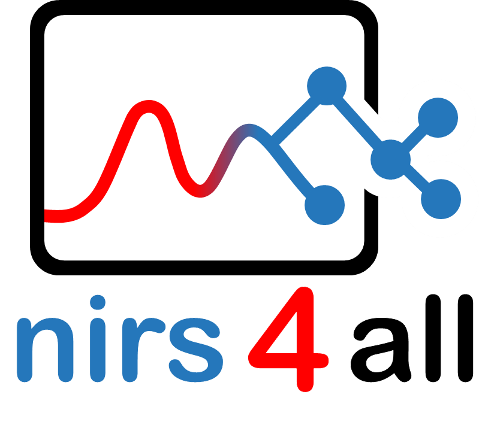

<div align="center">




# nirs4all Webapp

**Unified NIRS Analysis Desktop Application**

A modern desktop application for Near-Infrared Spectroscopy (NIRS) data analysis, combining the power of the [nirs4all](https://github.com/GBeurier/nirs4all) Python library with a sleek React-based user interface.

[](LICENSE)
[](https://nodejs.org/)
[](https://www.python.org/downloads/)

[Download](https://github.com/GBeurier/nirs4all-webapp/releases/latest) •
[User Guide](docs/user-guide/) •
[nirs4all Library](https://github.com/GBeurier/nirs4all) •
[Website](https://nirs4all.org)

</div>

---

<div align="center">

<br><em>Playground — Interactive spectral exploration with PCA, distributions, and preprocessing preview</em>
</div>

---

## Which nirs4all do you need?

nirs4all comes in two flavors — pick the one that fits your workflow:

| | **nirs4all Studio** (Desktop App) | **nirs4all** (Python Library) |
|---|---|---|
| **Best for** | Researchers, technicians, and anyone who prefers a visual interface | Developers, data scientists, and anyone who writes Python scripts |
| **What it is** | A desktop application with drag-and-drop pipelines, interactive charts, and one-click model training | A `pip install` Python package with a declarative API for building NIRS pipelines in code |
| **Install** | [Download the installer](https://github.com/GBeurier/nirs4all-webapp/releases/latest) | `pip install nirs4all` |
| **Repository** | **You are here** | [GBeurier/nirs4all](https://github.com/GBeurier/nirs4all) |

> **Not sure?** If you've never written Python code, start here with **nirs4all Studio**. It uses the [nirs4all Python library](https://github.com/GBeurier/nirs4all) under the hood and gives you all the same capabilities through a graphical interface.

---

## Installation

nirs4all Studio offers three ways to get started, depending on your needs:

### Option 1 — Installer (Recommended)

The simplest option. Downloads and installs like any desktop application.

1. Go to the [latest release](https://github.com/GBeurier/nirs4all-webapp/releases/latest)
2. Download the installer for your platform:

   | Platform | File |
   |----------|------|
   | **Windows** | `.exe` installer |
   | **macOS** (Intel & Apple Silicon) | `.dmg` disk image |
   | **Linux** | `.AppImage` or `.deb` package |

3. Run the installer and launch nirs4all Studio

The installer embeds a Python environment and manages dependencies automatically. **You don't need Python installed on your machine.**

> **GPU support**: The default installer is CPU-only. For GPU acceleration (CUDA on Linux/Windows, Metal on macOS), download the GPU edition from the release page (tagged `gpu` in the filename).

### Option 2 — All-in-one Standalone (Portable)

A self-contained archive — just extract and run. No installation, no admin rights needed. Ideal for trying nirs4all Studio without committing to an install, or for machines where you can't install software.

1. Go to the [latest release](https://github.com/GBeurier/nirs4all-webapp/releases/latest)
2. Download the **all-in-one** archive for your platform:

   | Platform | File |
   |----------|------|
   | **Windows** | `nirs4all-Studio-*-all-in-one-win-x64.zip` |
   | **macOS** | `nirs4all-Studio-*-all-in-one-mac-*.dmg` |
   | **Linux** | `nirs4all-Studio-*-all-in-one-linux-x64.tar.gz` |

3. Extract the archive and run the executable inside

Everything is bundled — Python runtime, backend, and frontend. Nothing else to install.

### Option 3 — Developer Setup (From Source)

For contributors, or if you want to hack on the code. Requires **Node.js 20+** and **Python 3.11+**.

```bash
git clone https://github.com/GBeurier/nirs4all-webapp.git
cd nirs4all-webapp
npm install
```

Then set up the Python backend and start the servers — see [Getting Started](#getting-started) below.

### Installation comparison

| | Installer | Standalone | Developer |
|---|---|---|---|
| **Install required** | Yes | No (extract & run) | Clone + npm install |
| **Python required** | No (bundled) | No (bundled) | Yes (3.11+) |
| **Auto-updates** | Yes | Manual re-download | git pull |
| **GPU editions** | CPU or GPU | CPU or GPU | Your choice |
| **Best for** | End users | Portable / trial use | Contributors |

---

## Getting Started

> This section is for **developers running from source** (Option 3 above). If you installed via the Installer or Standalone, just launch the app — no setup needed.

### Prerequisites

- Node.js 20+ (recommended: use `nvm` + the version in `.nvmrc`)
- Python 3.11+
- nirs4all library (optional for UI development)

### Cross-Platform Support

This project supports development on:
- **Windows Native** - PowerShell, cmd.exe, or Windows Terminal
- **Linux** - Any distribution with Node.js and Python
- **macOS** - Intel and Apple Silicon
- **WSL2** - Windows Subsystem for Linux

---

### Windows Native Setup

1. **Install Node dependencies:**
   ```cmd
   npm install
   ```

2. **Install Python dependencies:**
   ```cmd
   python -m venv .venv
   .venv\Scripts\activate
   pip install -r requirements-cpu.txt
   ```

3. **Start development servers:**

   ```cmd
   npm start             REM Frontend + backend together (web dev)
   npm run start:desktop REM Electron desktop mode
   npm run stop          REM Stop all servers
   ```

   Or run frontend and backend separately:
   ```cmd
   npm run dev          REM Frontend (Vite) at http://localhost:5173
   ```

   Terminal 2:
   ```cmd
   .venv\Scripts\activate
   python -m uvicorn main:app --reload --port 8000
   ```

---

### Linux / macOS Setup

1. **Install Node dependencies:**
   ```bash
   npm install
   ```

2. **Install Python dependencies:**
   ```bash
   python -m venv .venv
   source .venv/bin/activate
   pip install -r requirements-cpu.txt  # or requirements-gpu.txt for GPU
   ```

3. **Start development servers:**

   ```bash
   npm start             # Frontend + backend together (web dev)
   npm run start:desktop # Electron desktop mode
   npm run stop          # Stop all servers
   ```

   Or run frontend and backend separately:
   ```bash
   npm run dev          # Frontend (Vite) at http://localhost:5173
   ```

   Terminal 2:
   ```bash
   source .venv/bin/activate
   python -m uvicorn main:app --reload --port 8000
   ```

---

### WSL2 Setup (Windows Subsystem for Linux)

If you prefer using WSL2, make sure you're using Linux `node`/`npm` (not the Windows ones mounted under `/mnt/c`).

1. **One-time: permanently disable Windows PATH injection into WSL** (prevents UNC/cmd.exe install failures):
   ```bash
   sudo tee /etc/wsl.conf <<'EOF'
   [interop]
   appendWindowsPath=false
   EOF
   ```
   Then restart WSL from Windows:
   ```powershell
   wsl.exe --shutdown
   ```

2. **Install/use Node via nvm (WSL-native):**
   ```bash
   npm run setup:wsl
   nvm use
   ```

Quick check (should NOT point to `/mnt/c/...`):
```bash
which node
which npm
```

Then follow the Linux setup instructions above.

---

### Desktop Mode (Electron)

To run as a desktop application:

```bash
# Development mode (with hot reload)
npm run dev:electron

# Build and preview (production mode)
npm run electron:preview
```

The Electron main process automatically spawns the Python backend and manages its lifecycle.

> **Note**: The webapp can run **without nirs4all installed** for pure UI development. The backend will report missing capabilities but the frontend is fully functional.

---

## Screenshots

<div align="center">

<br><em>Pipeline Editor — Drag-and-drop builder with component library, validation, and hyperparameter tuning</em>
</div>

<br>

<div align="center">


<br><em>Left: Results with model ranking and CV scores — Right: Runs overview and monitoring</em>
</div>

<br>

<div align="center">


<br><em>Left: Inspector — prediction analysis and model diagnostics — Right: SHAP variable importance</em>
</div>

<br>

<div align="center">


<br><em>Left: Spectra Synthesis — realistic NIR data generation — Right: Predictions analysis</em>
</div>

---

## Features

- **Spectral Data Visualization** — Interactive charts for exploring NIRS spectra
- **Pipeline Builder** — Visual drag-and-drop pipeline construction
- **Experiment Wizard** — Guided experiment setup with preset templates
- **Prediction Engine** — Run trained models on new samples
- **SHAP Explainability** — Variable importance and model interpretation
- **Spectra Synthesis** — Generate realistic synthetic NIR data
- **Transfer Analysis** — Instrument transfer and domain adaptation tools
- **Workspace Management** — Organize datasets, pipelines, and results
- **Native Desktop Experience** — Runs as a standalone desktop app via Electron
- **GPU Acceleration** — CUDA (Linux/Windows) and Metal (macOS) support

---

## Tech Stack

### Frontend
- **React 19** with TypeScript (strict mode)
- **Vite** for fast development and optimized builds
- **Tailwind CSS** with custom scientific design system
- **shadcn/ui** component library
- **TanStack Query** for API state management
- **Framer Motion** for smooth animations

### Desktop Shell
- **Electron 40** for cross-platform desktop experience
- **Chromium** for consistent WebGL support across all platforms
- **IPC Bridge** for secure main/renderer communication

### Backend
- **FastAPI** for high-performance REST API
- **[nirs4all](https://github.com/GBeurier/nirs4all)** Python library for all NIRS analysis
- **WebSocket** for real-time training progress updates
- **PyInstaller** for standalone backend packaging

---

## Project Structure

```
nirs4all_webapp/
├── src/                    # React frontend source
│   ├── components/         # UI components
│   │   ├── layout/         # App layout (sidebar, header)
│   │   ├── pipeline-editor/# Pipeline Editor (see Architecture)
│   │   └── ui/             # shadcn/ui components
│   ├── context/            # React context providers
│   ├── data/               # Data models and registries
│   │   └── nodes/          # Node registry system
│   ├── lib/                # Utilities and helpers
│   ├── api/                # API client
│   ├── types/              # TypeScript type definitions
│   │   └── electron.d.ts   # Electron IPC types
│   └── pages/              # Route components
├── electron/               # Electron main process
│   ├── main.ts             # Main entry point (window management)
│   ├── preload.ts          # Secure IPC bridge (contextBridge)
│   ├── backend-manager.ts  # Python backend lifecycle management
│   ├── env-manager.ts      # Python environment detection and setup
│   └── logger.ts           # Persistent file logging
├── api/                    # FastAPI backend
│   ├── workspace.py        # Workspace management routes
│   ├── datasets.py         # Dataset operations
│   ├── pipelines.py        # Pipeline CRUD
│   ├── predictions.py      # Prediction storage
│   └── system.py           # Health, system info, and GPU detection
├── scripts/                # Build and utility scripts
│   ├── build-backend.cjs   # Python backend packaging (cross-platform)
│   └── build-release.cjs   # Full release build (cross-platform)
├── build/                  # Build configuration
│   └── entitlements.mac.plist  # macOS code signing entitlements
├── docs/                   # Documentation
│   └── _internals/         # Developer guides
├── public/                 # Static assets
├── main.py                 # FastAPI application entry
├── launcher.py             # PyInstaller entry point (production builds)
├── nirs4all-webapp.spec    # PyInstaller spec file
├── electron-builder.yml    # Electron packaging config
└── package.json            # Node dependencies
```

---

## Scripts

### Launcher (Cross-Platform)

Use the unified launcher for all modes:

| Windows | Linux/macOS | Description |
|---------|-------------|-------------|
| `scripts\launcher.cmd start web:dev` | `./scripts/launcher.sh start web:dev` | Start frontend + backend (web dev) |
| `scripts\launcher.cmd start desktop:dev` | `./scripts/launcher.sh start desktop:dev` | Start Electron desktop (dev) |
| `scripts\launcher.cmd stop` | `./scripts/launcher.sh stop` | Stop all servers |
| `scripts\launcher.cmd status` | `./scripts/launcher.sh status` | Show server status |

Or use `npm run start` / `npm run start:desktop` / `npm run stop` directly.

### npm Scripts - Development

| Command | Description |
|---------|-------------|
| `npm run dev` | Start Vite dev server |
| `npm run dev:electron` | Start Electron with hot reload |
| `npm run dev:registry` | Start with node registry enabled |
| `npm run lint` | Run ESLint |
| `npm run test` | Run Vitest tests |
| `npm run test:watch` | Run tests in watch mode |
| `npm run storybook` | Start Storybook dev server |

### npm Scripts - Production Builds

| Command | Description |
|---------|-------------|
| `npm run build` | Build frontend for production |
| `npm run build:electron` | Build Electron app |
| `npm run electron:preview` | Preview Electron production build |
| `npm run build:backend` | Build Python backend (CPU, default) |
| `npm run build:backend:cpu` | Build Python backend (CPU) |
| `npm run build:backend:gpu` | Build Python backend (GPU/CUDA) |
| `npm run build:backend:gpu-metal` | Build Python backend (GPU/Metal for macOS) |
| `npm run build:backend:clean` | Clean and rebuild backend |
| `npm run build:release` | Full release build (CPU, current platform) |
| `npm run build:release:cpu` | Full release build (CPU edition) |
| `npm run build:release:gpu` | Full release build (GPU edition) |
| `npm run build:release:clean` | Clean and rebuild release |
| `npm run build:release:all` | Build for all platforms |

### Build Modes

The release build supports two modes via `--mode`:

- **`installer`** (default) — Embeds a Python environment with a venv. Supports runtime `pip install` for optional dependencies. Produces platform-native installers (`.exe`, `.dmg`, `.deb`).
- **`standalone`** — Freezes the backend with PyInstaller into a single executable. Produces portable all-in-one archives. No Python needed on the target machine.

```bash
node scripts/build-release.cjs --mode installer --flavor cpu
node scripts/build-release.cjs --mode standalone --flavor gpu
```

### npm Scripts - Packaging

| Command | Description |
|---------|-------------|
| `npm run electron:build` | Package for current platform |
| `npm run build:release --platform win` | Package for Windows |
| `npm run build:release --platform mac` | Package for macOS |
| `npm run build:release --platform linux` | Package for Linux |
| `npm run build:release --platform all` | Package for all platforms |

---

## Logging and Crash Reporting

### Persistent Logs

In desktop mode, all main process logs are written to rotating log files:

| OS | Log location |
|----|-------------|
| Windows | `%APPDATA%\nirs4all-webapp\logs\` |
| macOS | `~/Library/Application Support/nirs4all-webapp/logs/` |
| Linux | `~/.config/nirs4all-webapp/logs/` |

### Sentry Crash Reporting (optional)

Automatic crash reporting via [Sentry](https://sentry.io/) can be enabled by setting the `SENTRY_DSN` environment variable. This captures errors from the Electron main process, the React frontend, and the Python backend.

```bash
# Set before launching the app
SENTRY_DSN=https://your-key@o123456.ingest.sentry.io/1234567

# For the React frontend (build-time), add to .env.production:
VITE_SENTRY_DSN=https://your-key@o123456.ingest.sentry.io/1234567
```

When `SENTRY_DSN` is not set, crash reporting is completely disabled with zero overhead. See [docs/ELECTRON.md](docs/ELECTRON.md#crash-reporting-sentry) for details.

---

## Documentation

| Document | Description |
|----------|-------------|
| [docs/ELECTRON.md](docs/ELECTRON.md) | Electron architecture, logging, and crash reporting |
| [docs/PACKAGING.md](docs/PACKAGING.md) | Build system, CI/CD, and release process |
| [docs/UPDATE_SYSTEM.md](docs/UPDATE_SYSTEM.md) | Auto-updater implementation |
| [docs/sources/custom-nodes-guide.md](docs/sources/custom-nodes-guide.md) | Custom node development |

---

## License

This project is licensed under the [CeCILL-2.1 License](LICENSE).
Third-party notices are listed in [THIRD_PARTY_NOTICES.md](THIRD_PARTY_NOTICES.md), and the corresponding license texts are bundled in [LICENSES/](LICENSES).

---

## Acknowledgments

- [CIRAD](https://www.cirad.fr/) for supporting this research
- The [nirs4all](https://github.com/GBeurier/nirs4all) library for the NIRS analysis engine
- The open-source scientific Python and React communities

<div align="center">
<br>
<strong>Made for the spectroscopy community</strong>
</div>
